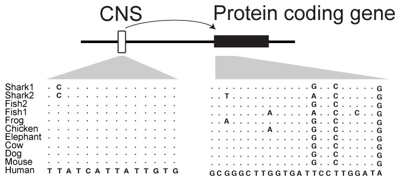

# dbCNS
 Database of conserved non-coding sequence

<table width="200" border="0">
  <tr>
    <td>dbCNS is a database of Conserved Non-coding Sequences (CNSs). 
        The database consists of published CNEs and genome sequences. 
        Users can  
            - collect published CNSs using a key word such as target gene name. 
            - generate a candidate CNS sequence using a user-defined-SNP cortinate. 
            - make multiple alignments of CNSs by uploading query sequences. 
  </tr>
  <tbody>
    <tr>
      <td></td>
    </tr>
  </tbody>
</table>  

<b>Web servise:</b> Under construction  (28 Jan. 2019).  
