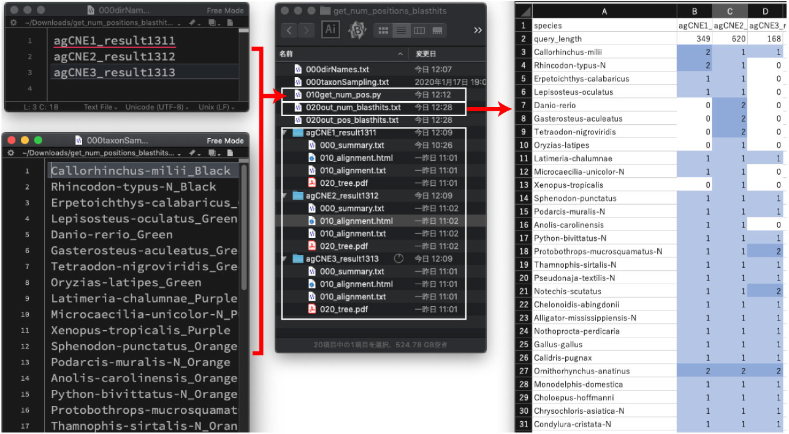

# dbCNS

<table width="200" border="0">
  <tr>
    <td>dbCNS (http://yamasati.nig.ac.jp/dbcns) is a database and an identification pipeline for conserved noncoding sequences (CNSs) of vertebrates. The database contains 2 sources: more than 680,000 published CNSs and 170 vertebrate genome sequences.<br>
Users can <br>
- find CNSs near interested genes from the database by uploading keywords.<br>
- construct multiple sequence alignments and CNS trees by uploading CNS sequences as queries.<br>
</td>
  </tr>
  <tbody>
    <tr>
      <td></td>
    </tr>
  </tbody>
</table>  

<b>Japanese instruction (日本語の説明):</b> [http://yamasati.nig.ac.jp/dbcns/instructions.html](http://yamasati.nig.ac.jp/dbcns/instructions.html)

<br><br>


---

## Web sites
NIG (from 27 Jan 2020)   
[http://yamasati.nig.ac.jp/dbcns](http://yamasati.nig.ac.jp/dbcns).

<br />  

---
## The 2nd analysis using output
By using selected sequences of dbCNS results, users can construct alignments and CNS trees secondary.  
I made an analysis pipeline for this 2nd step. The script is specialized for a Macintosh use with Python 3. Windows users need some modifications.  
Analysis pipeline with example data: [cre21.zip](https://github.com/jun-inoue/dbCNS/tree/master/images/cre21.zip).
<br />  


### Installing Dependencies

The 2nd analysis  requires some dependencies to be installed and in the system path in your computer.
<br />  


#### Mafft v7.407:
Available here: [https://mafft.cbrc.jp/alignment/software/](https://mafft.cbrc.jp/alignment/software/).  
After compilation, set your PATH following [this site](https://mafft.cbrc.jp/alignment/software/add_path.html).  
<br />  


#### trimAl v1.2 (Official release):
Available here: [http://trimal.cgenomics.org/downloads](http://trimal.cgenomics.org/downloads).  
Cd to trimAl/source, type make, and copy the executable.
```
make
cp trimal ~/bin
```  
<br />  

#### Ape in R:
R (3.5.2) is available from [here](https://cran.ism.ac.jp).  
By installing R, [rscript](https://stat.ethz.ch/R-manual/R-devel/library/utils/html/Rscript.html) will be installed automatically.  
[APE in R](http://ape-package.ird.fr) can be installed from the R console as follows:
```
install.packages("ape")
```
<br />  


### The 2nd analysis

Using the downloaded pipeline, the 2nd anlaysi will be conducted as follows:
- Based on the 1st alignment and CNS tree, users should select sequences manually. Then the pipeline can start subsequent analyese.
- Selected sequences are aligned using MAFFT (Katoh et al. 2005). 
- Multiple sequence alignments are trimmed by removing poorly aligned regions using TRIMAL 1.2 (Capella-Gutierrez et al. 2009) with the option “gappyout.” 
- Phylogenetic analysis is performed with Ape in R (Popescu et al. 2012) with the TN 93 (Tamura and Nei 1993) + gamma (Yang 1994) model. 

The actual rocess is as follows:   

1. Decompress the downloaded cre21.zip. Open cre21.zip file and decompress 100_2ndAnalysis.zip file.

2. Select an appropriate sequences and save 010_alignment.txt file.

3. cd into the 100_2ndAnalysis directory.

4. Run the pipeline.
```
python3 100_estimate2nd.py
```
5. Automatically, the 2nd alignment is saved in the 200_alignment.html file and the 2nd CNS tree is save in the 200_NJTree.pdf file.

<br />  

### Detecting accelerated CNSs as long branches

Using the branch lengths of the 2nd CNS tree, users can can detect accelerated CNSs.   Branch lengths from root to tip are save in the 200_branchLengths.txt file.   I made a R script to perform the Mann-Whitney U test for branch lengths.

From the terminal, Mac users can run the script as follows:
```
R --save <110_Wilcoxon-rank-sum-test.R >110_commandlog.txt
```
In this script, the branch lengths are compared between foreground and background. Users should write species names in the foreground_species variable (line 9).

<br />  

### Count the number of blast hits from multiple results

Using the downloaded pipeline, the number of blast hits can be counted from multiple results:

1. Download and decompress [get_num_positions_blasthits.zip](images/get_num_positions_blasthits.zip). 

2. From you terminal, cd into get_num_positions_blasthits directory.

3. Run the pipeline.
```
python3 010get_num_pos.py
```
4. Open 020out_num_blasthits.txt file by your Excel.




<br />  
